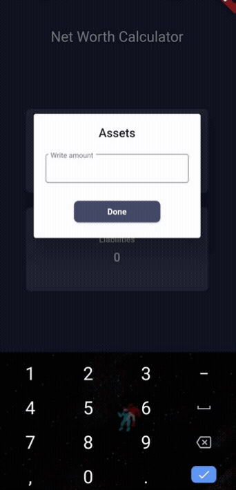

<!-- PROJECT LOGO -->
<br />
<p align="center">
  <h1 align="center">Net Worth Calculator</h1>

  <p align="center">
    Calculate your networth on tap of a button!
</p>


<!-- TABLE OF CONTENTS -->
<details open="open">
  <summary><h2 style="display: inline-block">Table of Contents</h2></summary>
  <ol>
    <li>
      <a href="#about-the-project">About The Project</a>
      <ul>
        <li><a href="#built-with">Built With</a></li>
      </ul>
    </li>
    <li>
      <a href="#getting-started">Getting Started</a>
      <ul>
        <li><a href="#prerequisites">Prerequisites</a></li>
        <li><a href="#installation">Installation</a></li>
      </ul>
    </li>
    <li><a href="#usage">Usage</a></li>
    <li><a href="#contact">Contact</a></li>
  </ol>
</details>


<!-- ABOUT THE PROJECT -->
## About The Project
A net worth calculator that inputs the user's assets and liabilities to calculate their net worth.

### Built With

* []() Flutter
* []() Dart
* []() VS code


<!-- GETTING STARTED -->
## Getting Started

1. Clone the repository
2. Open folder on VS Code
3. Connect your emulator
4. Open a terminal on VS code and do flutter -run

### Prerequisites

To run this application, you need the latest version of flutter
* [Flutter](https://flutter.dev/docs/get-started/install)
  ```sh
  C:\src>git clone https://github.com/flutter/flutter.git -b stable
  ```

### Installation

1. Clone the repo
   ```sh
   git clone https://github.com/Vishnuanand77/NetWorthApp.git
   ```
2. Running the application on emulator
   ```sh
   flutter run
   ```


<!-- USAGE EXAMPLES -->
## Usage
<p align = "center">



## License
See `LICENSE` for more information.


<!-- CONTACT -->
## Contact
Vishnu Anand <br><br>
    Twitter : [@vishnuanand2000](https://twitter.com/vishnuanand2000) <br>
    Instagram : [@yesvisnu](https://www.instagram.com/yesvisnu/) <br>
    Email : vishnuanand2000@gmail.com
